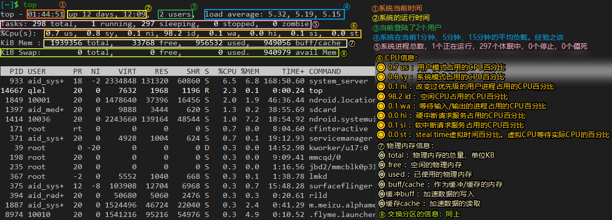
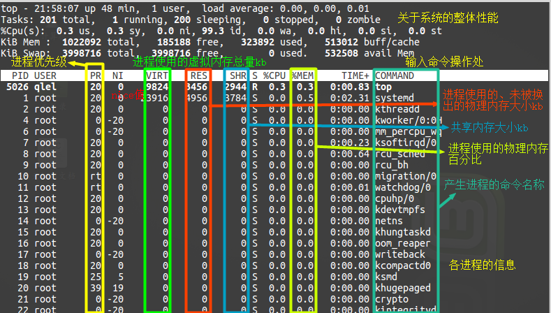

+++
author = "qlel"
title = "Linux_top"
date = "2023-08-13"
description = "top命令用于Linux系统资源监控。"
tags = [
"shell", "linux", "bash"
]
categories = [
"学习"
]
+++
`top`命令用于Linux系统资源监控。

## top
直接运行`top`命令会出现交互式界面，以下图片相关信息：





## 选项
选项|说明
-|-
`-h`或`-v`|显示版本和使用提示，然后退出
`-b`|批量模式，传递输出到其它程序或文件；与`-n`一起用。
`-c`|显示命令或程序的完整路径
`-d 秒数`|指定top命令每隔几秒刷新，默认3s
`-E 单位`|指定显示存储时使用的单位，有 k, m, g, t, p, e
`-H`|显示线程(一个进程有多个线程)
`-i`|切换显示空闲进程
`-n 次数`|指定刷新几次结束，一般与`-b`一起用
`-o 字段名`|指定排序字段，字段前缀 '+' 表示降序，'-'表示升序
`-O`|列出可选的字段名，`-o`选项的可选值
`-pN1,N2,N3...`|只监控特定的PID，N1,N2,N3表示多个PID
`-s`|安全模式
`-U 用户`或`-u 用户`|只显示特定用户

## 管理字段
在交互模式下，按`f`或`F`进入字段管理窗口：
```bash
Fields Management for window 1:Def, whose current sort field is %CPU
   Navigate with Up/Dn, Right selects for move then <Enter> or Left commits,
   'd' or <Space> toggles display, 's' sets sort.  Use 'q' or <Esc> to end!

* PID     = Process Id             TIME    = CPU Time               RSan    = RES Anonymous (KiB)
* USER    = Effective User Name    SWAP    = Swapped Size (KiB)     RSfd    = RES File-based (KiB)
* PR      = Priority               CODE    = Code Size (KiB)        RSlk    = RES Locked (KiB)
* NI      = Nice Value             DATA    = Data+Stack (KiB)       RSsh    = RES Shared (KiB)
* VIRT    = Virtual Image (KiB)    nMaj    = Major Page Faults      CGNAME  = Control Group name
* RES     = Resident Size (KiB)    nMin    = Minor Page Faults      NU      = Last Used NUMA node
* SHR     = Shared Memory (KiB)    nDRT    = Dirty Pages Count
* S       = Process Status         WCHAN   = Sleeping in Function
* %CPU    = CPU Usage              Flags   = Task Flags <sched.h>
* %MEM    = Memory Usage (RES)     CGROUPS = Control Groups
* TIME+   = CPU Time, hundredths   SUPGIDS = Supp Groups IDs
* COMMAND = Command Name/Line      SUPGRPS = Supp Groups Names
  PPID    = Parent Process pid     TGID    = Thread Group Id
  UID     = Effective User Id      OOMa    = OOMEM Adjustment
  RUID    = Real User Id           OOMs    = OOMEM Score current
  RUSER   = Real User Name         ENVIRON = Environment vars
  SUID    = Saved User Id          vMj     = Major Faults delta
  SUSER   = Saved User Name        vMn     = Minor Faults delta
  GID     = Group Id               USED    = Res+Swap Size (KiB)
  GROUP   = Group Name             nsIPC   = IPC namespace Inode
  PGRP    = Process Group Id       nsMNT   = MNT namespace Inode
  TTY     = Controlling Tty        nsNET   = NET namespace Inode
  TPGID   = Tty Process Grp Id     nsPID   = PID namespace Inode
  SID     = Session Id             nsUSER  = USER namespace Inode
  nTH     = Number of Threads      nsUTS   = UTS namespace Inode
  P       = Last Used Cpu (SMP)    LXC     = LXC container name
```
显示说明：
- “当前”窗口名；
- 指定的排序字段；
- 按当前顺序排列的所有字段以及说明。如果屏幕宽度允许，标有星号的条目是当前显示的字段。
- <kbd>↑</kbd>与<kbd>↓</kbd>进行移动
- <kbd>→</kbd>选择要重新定位的字段
- <kbd>←</kbd>或<kbd>Enter</kbd>提交该字段的位置
- <kbd>d</kbd>或<kbd>Space</kbd>切换字段的显示状态，有`*`表示显示
- <kbd>s</kbd>指定一个字段作为排序字段
- <kbd>a</kbd>和<kbd>w</kbd>用于在被选择字段中循环移动
- <kbd>q</kbd>和<kbd>Esc</kbd>退出字段管理窗口

## 交互指令
以下指令可能重复，因为在特定的上下文中有不同的效果。

>注意： 字母大小写区分。

### 全局指令
- <kbd>Enter</kbd>或<kbd>Space</kbd>: 刷新显示
- <kbd>?</kbd>或<kbd>h</kbd>: 帮助信息
- <kbd>0</kbd>: 切换是否显示0
- <kbd>A</kbd>: 多行显示所有字段
- <kbd>d</kbd>或<kbd>s</kbd>: 输入刷新秒数，默认3s
- <kbd>E</kbd>: 切换上方信息的存储单位
- <kbd>e</kbd>: 切换下方信息的存储单位
- <kbd>e</kbd>: 切换下方信息的存储单位
- <kbd>g</kbd>: 切换显示组，有默认4个组
- <kbd>H</kbd>: 切换显示线程模式
- <kbd>k</kbd>: 会提示输入要杀死的PID
- <kbd>q</kbd>: 退出
- <kbd>W</kbd>: 保存状态至下一次启动还原
- <kbd>X</kbd>: 设置字段宽度
- <kbd>Z</kbd>: 打开设置颜色窗口

### 摘要视图
- <kbd>C</kbd>: 显示滚动坐标切换
- <kbd>1</kbd>: CPU平均负载/正常运行时间切换
- <kbd>t</kbd>: CPU状态切换
- <kbd>m</kbd>: 内存状态切换

### 任务视图
外观：
- <kbd>j</kbd>和<kbd>J</kbd>: 对齐方式的切换
- <kbd>b</kbd>: 前景色和背景色的切换
- <kbd>x</kbd>: 突出显示排序列
- <kbd>y</kbd>: 突出显示行
- <kbd>z</kbd>: 切换上次使用的颜色

内容：
- <kbd>c</kbd>: 切换完整路径命令
- <kbd>S</kbd>: 累积时间模式切换
- <kbd>u</kbd>和<kbd>U</kbd>: 显示特定用户
- <kbd>V</kbd>: 树结构切换

窗口任务数量：
- <kbd>i</kbd>: 空闲状态进程切换
- <kbd>n</kbd>和<kbd>#</kbd>: 输入窗口显示任务数量

排序：
<kbd>P</kbd>：以CPU使用率排序，默认就是此项
<kbd>M</kbd>：以内存使用率排序
<kbd>N</kbd>：以PID排序
<kbd>R</kbd>：在当前基础上反向排序