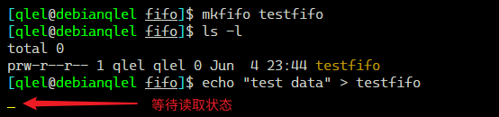

+++
author = "qlel"
title = "Linux 命名管道 FIFO"
date = "2023-08-13"
description = "Linux 命名管道 FIFO"
tags = [
"shell", "linux", "bash"
]
categories = [
"学习"
]
+++

## 文件描述符

文件描述符（缩写 `fd`）在形式上是一个非负整数。实际上，它是一个索引值，指向内核为每一个进程所维护的该进程打开文件的记录表。当程序打开一个现有文件或者创建一个新文件时，内核向进程返回一个文件描述符。每一个 unix 进程，都会拥有三个标准的文件描述符，来对应三种不同的流：

| 文件描述符 | 名称     |
| ---------- | -------- |
| `0`        | 标准输入 |
| `1`        | 标准输出 |
| `2`        | 标准错误 |

除了上面三个标准的描述符外，我们还可以在进程中去自定义其他的数字作为文件描述符。`ulimit -n` 查询可以使用的数字。

```bash
$ ulimit -n
1024
```

可以看到值为 1024 ，所以文件操作符只能使用 0-1023，可自行定义的就只能是 3-1023 了。

每一个文件描述符会对应一个打开文件，同时，不同的文件描述符也可以对应同一个打开文件；同一个文件可以被不同的进程打开，也可以被同一个进程多次打开。

在 `/proc/PID/fd` 中，列举了进程 PID 所拥有的文件描述符：

```bash
#!/bin/bash

echo "该进程的pid为$$"

exec 1>./test.log 2>&1

ls -l /proc/$$/fd/
```

结果：

```bash
该进程的pid为1869

# test.log
total 0
lrwx------ 1 qlel qlel 0 Jun  4 16:12 0 -> /dev/tty3
l-wx------ 1 qlel qlel 0 Jun  4 16:12 1 -> /mnt/d/MarkdownLearnNote/shell/exp/pipe/test.log
l-wx------ 1 qlel qlel 0 Jun  4 16:12 2 -> /mnt/d/MarkdownLearnNote/shell/exp/pipe/test.log
lr-x------ 1 qlel qlel 0 Jun  4 16:12 255 -> /mnt/d/MarkdownLearnNote/shell/exp/pipe/test.sh
```

## linux 管道

在 Unix 或类 Unix 操作系统中，管道是一个由标准输入输出链接起来的进程集合，因此，每一个进程的输出将直接作为下一个进程的输入。

linux 管道包含两种：

- 匿名管道
- 命名管道

管道有一个特点，如果管道中没有数据，那么取管道数据的操作就会滞留，直到管道内进入数据，然后读出后才会终止这一操作；同理，写入管道的操作如果没有读取管道的操作，这一动作就会滞留。

### 匿名管道

在 Unix 或类 Unix 操作系统的命令行中，匿名管道垂直线 `|` 作为匿名管道符，匿名管道的两端是两个普通的，匿名的，打开的文件描述符：一个只读端和一个只写端，这就让其它进程无法连接到该匿名管道。

### 命名管道

命名管道也称 FIFO，从语义上来讲，FIFO 其实与匿名管道类似，但值得注意：

- 在文件系统中，FIFO 拥有名称，并且是以设备特俗文件的形式存在的；
- 任何进程都可以通过 FIFO 共享数据；
- 除非 FIFO 两端同时有读与写的进程，否则 FIFO 的数据流通将会阻塞；
- 匿名管道是由 shell 自动创建的，存在于内核中；而 FIFO 则是由程序创建的（比如 `mkfifo` 命令），存在于文件系统中；
- 匿名管道是单向的字节流，而 FIFO 则是双向的字节流；

管道有一个特点，如果管道中没有数据，那么取管道数据的操作就会停滞，直到管道内进入数据，然后读出后才会终止这一操作，同理，写入管道的操作如果没有读取操作，这一个动作也会停滞。

示例：首先创建命名管道，然后写入数据，会陷入停滞，直到数据被读出。



当我们试图用 `echo` 想管道文件中写入数据时，由于没有任何进程在对它做读取操作，所以它会一直停留在那里等待读取操作，此时我们在另一终端上用 `cat` 指令做读取操作:


同理，先进行读取操作也一样会陷入停滞，直到数据被写入。

## 多进程的实现

首先看一段程序：

```bash
#!/usr/bin/env bash

start_time=$(date "+%s")

for (( i = 1; i <= 4; i++ )); do
	echo "success"
	sleep 2
done

end_time=$(date "+%s")

echo "TIME: $(($end_time-$start_time))"
```

结果耗时 8s：

```bash
success
success
success
success
TIME: 8
```

这种不占处理器却有很耗时的进程，我们可以通过一种后台运行的方式来达到节约时间的目的。看如下多进程实现：

```bash
#!/usr/bin/env bash

start_time=$(date "+%s")

for (( i = 1; i <= 4; i++ )); do
	# 将程序放进大括号块中，& 放到后台执行
	{
		echo "success"
		sleep 2
	}&
done

# 等待所有后台进程执行结束
wait
end_time=$(date "+%s")

echo "TIME: $(($end_time-$start_time))"
```

用“`{}`”将主执行程序变为一个块，用 `&` 放入后台，四次执行全部放入后台后，我们需要用一个 `wait` 指令，等待所有后台进程执行结束，不然 系统是不会等待的，直接继续执行后续指令，知道整个程序结束。

执行结果只是耗时 3s，还是因为 `sleep` 多等了 2s：

```bash
success
success
success
success
TIME: 3
```

---

以上实验虽然达到了多进程并发的目的，但有一个缺陷，不能控制运行在后台的进程数。

为了控制进程，我们引入了**管道**和**文件操作符**。

管道有一个特点，如果管道中没有数据，那么取管道数据的操作就会停滞，直到管道内进入数据，然后读出后才会终止这一操作，同理，写入管道的操作如果没有读取操作，这一个动作也会停滞。

控制进程的实现(但是我运行时，read 命令似乎并没有阻塞，不成功？)

```bash
#!/usr/bin/env bash

# 调试
# set -x

# exec &>stdout.log

# 接受信号 2 （ctrl +C）做的操作，抛出异常。
# 关闭文件描述符6，退出脚本
# > 读； < 写
trap "exec 6>&-;exec 6<&-;exit 0" 2

tmp_fifofile="$$.fifo"

# 创建命名管道
if [[ -p $tmp_fifofile ]]; then
	mkfifo $tmp_fifofile
fi

# 把文件描述符6和FIFO进行绑定
exec 6<>$tmp_fifofile
# 绑定后，该文件就可以删除了
rm -f $tmp_fifofile

# 并发量为10，用这个数字来控制并发数
thread=10
for (( i = 0; i < $thread; i++ )); do
	# 写一个空行到管道里，因为管道文件的读取以行为单位
	echo >&6
done

# 开始时间
start_time=$(date "+%s")
# 假定有100个任务，保证后台只有10个进程在同步运行
for (( i = 0; i < 100; i++ )); do
	read -u 6
	{
		echo "success ${i}"
		sleep 2
		echo >&6 
		# 每次执行完以上代码，都要往fd6中写入一个空行，以便后续执行
		# 如果没有此步骤，read在读取完以上10行后会陷入停滞
	}&
done

# 等待所有后台进程执行结束
wait
# 结束时间
end_time=$(date "+%s")
echo "总花费时间：$(($end_time-$start_time))"

# 关闭文件描述符6
exec 6>&-
exec 6<&-
```
