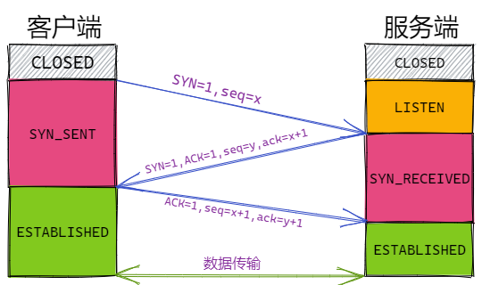
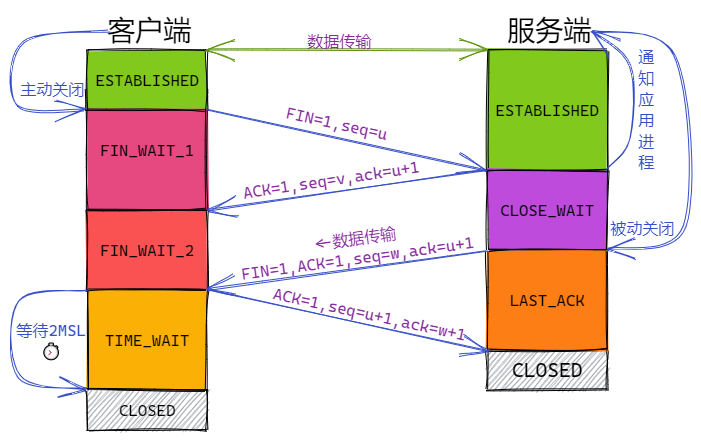

+++
author = "qlel"
title = "TCP的三次握手和四次挥手"
date = "2023-08-16"
description = "TCP的三次握手和四次挥手"
tags = [
"网络"
]
categories = [
"学习"
]
+++

TCP的三次握手和四次挥手.

## TCP报文的结构
TCP是一种面向连接的、可靠的、基于字节流的传输层通信协议，在发送数据前，通信双方必须在彼此间建立一条连接.


TCP报文的结构中有几个字段需要重点介绍:
- `序号`
seq序号，占32位，用来标识从TCP源端向目的端发送的字节流，发起方发送数据时对此进行标记, 初始序号ISNs(initial sequence numbers)是随机产生的
- `确认号`
ack序号，占32位，只有ACK标志位为1时，确认序号字段才有效，ack=seq+1。注意不要将确认序号ack与标志位中的ACK搞混了
- `标志位`：共6个，即URG、ACK、PSH、RST、SYN、FIN
  - ACK：确认序号有效。
  - FIN：释放一个连接。
  - PSH：接收方应该尽快将这个报文交给应用层。
  - RST：重置连接。
  - SYN：发起一个新连接。
  - URG：紧急指针（urgent pointer）有效。

## 状态名词解析
11种状态名词解析​​​​​​​:
```c
LISTEN：等待从任何远端TCP 和端口的连接请求。
 
SYN_SENT：发送完一个连接请求后等待一个匹配的连接请求。
 
SYN_RECEIVED：发送连接请求并且接收到匹配的连接请求以后等待连接请求确认。
 
ESTABLISHED：表示一个打开的连接，接收到的数据可以被投递给用户。连接的数据传输阶段的正常状态。
 
FIN_WAIT_1：等待远端TCP 的连接终止请求，或者等待之前发送的连接终止请求的确认。
 
FIN_WAIT_2：等待远端TCP 的连接终止请求。
 
CLOSE_WAIT：等待本地用户的连接终止请求。
 
CLOSING：等待远端TCP 的连接终止请求确认。
 
LAST_ACK：等待先前发送给远端TCP 的连接终止请求的确认（包括它字节的连接终止请求的确认）
 
TIME_WAIT：等待足够的时间过去以确保远端TCP 接收到它的连接终止请求的确认。
TIME_WAIT 两个存在的理由：
          1.可靠的实现tcp全双工连接的终止；
          2.允许老的重复分节在网络中消逝。
 
CLOSED：不在连接状态（这是为方便描述假想的状态，实际不存在）
```

## 三次握手



1. **第一次握手**：客户端要向服务端发起连接请求，首先客户端随机生成一个起始序列号(比如是100)，那客户端向服务端发送的报文段包含SYN标志位(也就是SYN=1)，序列号seq=100。
2. **第二次握手**：服务端收到客户端发过来的报文后，发现SYN=1，知道这是一个连接请求，于是将客户端的起始序列号100存起来，并且随机生成一个服务端的起始序列号(比如是300)。然后给客户端回复一段报文，回复报文包含SYN和ACK标志(也就是SYN=1,ACK=1)、序列号seq=300、确认号ack=101(客户端发过来的序列号+1)。
3. **第三次握手**：客户端收到服务端的回复后发现ACK=1并且ack=101,于是知道服务端已经收到了序列号为100的那段报文；同时发现SYN=1，知道了服务端同意了这次连接，于是就将服务端的序列号300给存下来。然后客户端再回复一段报文给服务端，报文包含ACK标志位(ACK=1)、ack=301(服务端序列号+1)、seq=101(第一次握手时发送报文是占据一个序列号的，所以这次seq就从101开始，需要注意的是不携带数据的ACK报文是不占据序列号的，所以后面第一次正式发送数据时seq还是101)。当服务端收到报文后发现ACK=1并且ack=301，就知道客户端收到序列号为300的报文了，就这样客户端和服务端通过TCP建立了连接。

## 四次挥手

四次挥手的目的是关闭一个连接.



比如客户端初始化的序列号ISA=100，服务端初始化的序列号ISA=300。TCP连接成功后客户端总共发送了1000个字节的数据，服务端在客户端发FIN报文前总共回复了2000个字节的数据。

1. **第一次挥手**：当客户端的数据都传输完成后，客户端向服务端发出连接释放报文(当然数据没发完时也可以发送连接释放报文并停止发送数据)，释放连接报文包含FIN标志位(FIN=1)、序列号seq=1101(100+1+1000，其中的1是建立连接时占的一个序列号)。需要注意的是客户端发出FIN报文段后只是不能发数据了，但是还可以正常收数据；另外FIN报文段即使不携带数据也要占据一个序列号。
2. **第二次挥手**：服务端收到客户端发的FIN报文后给客户端回复确认报文，确认报文包含ACK标志位(ACK=1)、确认号ack=1102(客户端FIN报文序列号1101+1)、序列号seq=2300(300+2000)。此时服务端处于关闭等待状态，而不是立马给客户端发FIN报文，这个状态还要持续一段时间，因为服务端可能还有数据没发完。
3. **第三次挥手**：服务端将最后数据(比如50个字节)发送完毕后就向客户端发出连接释放报文，报文包含FIN和ACK标志位(FIN=1,ACK=1)、确认号和第二次挥手一样ack=1102、序列号seq=2350(2300+50)。
4. **第四次挥手**：客户端收到服务端发的FIN报文后，向服务端发出确认报文，确认报文包含ACK标志位(ACK=1)、确认号ack=2351、序列号seq=1102。注意客户端发出确认报文后不是立马释放TCP连接，而是要经过2MSL(最长报文段寿命的2倍时长)后才释放TCP连接。而服务端一旦收到客户端发出的确认报文就会立马释放TCP连接，所以服务端结束TCP连接的时间要比客户端早一些。