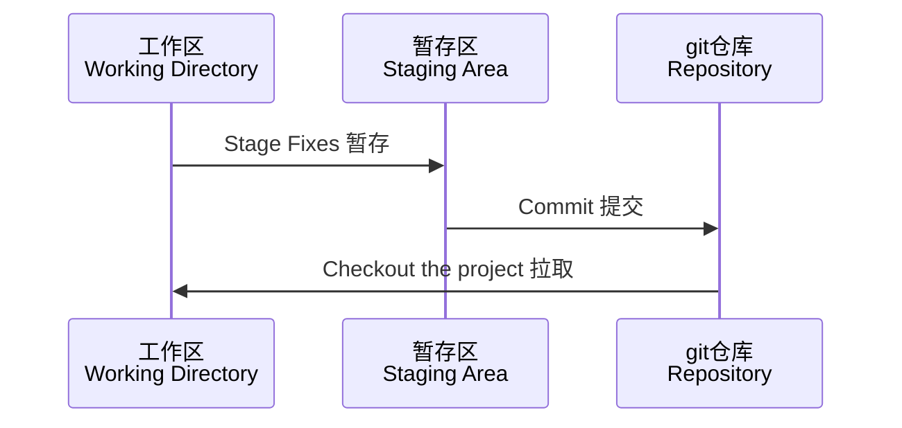
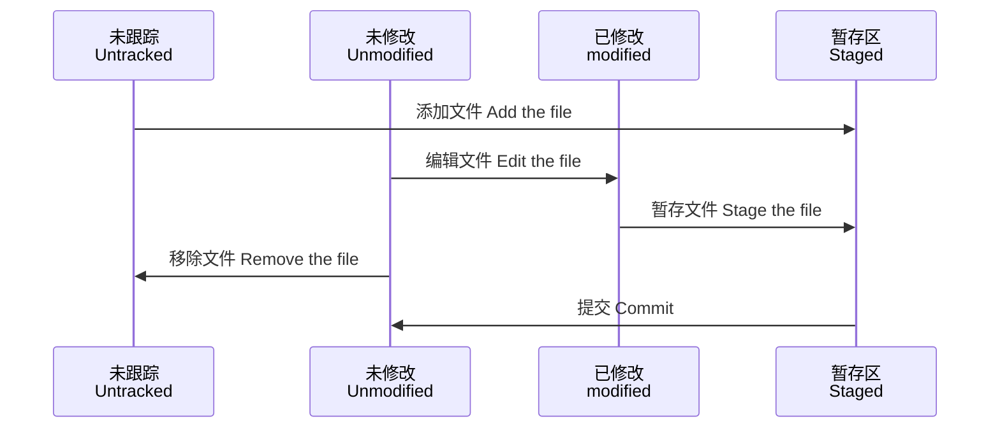

+++
author = "qlel"
title = "git 学习"
date = "2023-08-12"
description = "git2021 年的学习记录"
tags = [
"git"
]
categories = [
"学习"
]
+++

## git 的基本工作流程

> Git 有三种状态



- 工作区：添加、编辑、修改文件等动作
- 暂存区：暂存已经修改的文件，最后统一提交到 git 仓库
- 仓库区：最终确定的文件保存到仓库

> git 的基本工作流程

1. 在工作目录中修改文件。
2. 暂存文件，将文件的快照放入暂存区域。
3. 提交更新，找到暂存区域的文件，将快照永久性存储到 Git 仓库目录。

## 配置基本信息

```git
$ git config --global user.name "John Doe"
$ git config --global user.email johndoe@example.com
```

如果使用了 `--global` 选项，那么该命令只需要运行一次，因为之后无论你在该系统上做任何事情， Git 都会使用那些信息。

当你想针对特定项目使用不同的用户名称与邮件地址时，可以在那个项目目录下运行没有 `--global` 选项的命令来配置。

Git 会使用操作系统默认的文本编辑器，使用不同的编辑器命令：

```git
$ git config --global core.editor vim
```

> 检查配置信息

```git
# 检查所有配置信息
$ git config --list
user.name=John Doe
user.email=johndoe@example.com
color.status=auto
color.branch=auto
...

# 检查特点配置信息
$ git config <key>
$ git config user.name
```

在 Windows 系统中，Git 会查找 `$HOME` 目录下（一般情况下是 `C:\Users\$USER`）的 `.gitconfig` 文件。

如果在一个初始化为本地仓库 `git init` 的目录中，会有一个 `.git` 隐藏文件夹，里面的 `config` 文件也是配置文件。

```git
$ cat ~\.gitconfig

core.symlinks=false
core.autocrlf=true
core.fscache=true
color.diff=auto
color.status=auto
color.branch=auto
color.interactive=true
help.format=html
diff.astextplain.textconv=astextplain
rebase.autosquash=true
filter.lfs.clean=git-lfs clean -- %f
filter.lfs.smudge=git-lfs smudge -- %f
filter.lfs.process=git-lfs filter-process
filter.lfs.required=true
credential.helper=helper-selector
filter.lfs.clean=git-lfs clean %f
filter.lfs.smudge=git-lfs smudge %f
filter.lfs.required=true
user.name=qlel
user.email=1076877107@qq.com
use.name=qlel
```

## 创建新仓库

> 在现有目录中初始化仓库

```git
$ git init
```

该命令将创建一个名为 `.git` 的子目录，这个子目录含有你初始化的 Git 仓库中所有的必须文件，这些文件是 Git 仓库的骨干。

但是，在这个时候，我们仅仅是做了一个初始化的操作，你的项目里的文件还没有被跟踪。

## 克隆现有的仓库

```git
git clone [url]

# 示例
git clone https://gitee.com/qlel/blog.git

# 会在当前目录创建blog目录
cd blog

ls -la

drwxrwxrwx 1 qlel qlel 4096 Jul 17 09:24 .
drwxrwxrwx 1 qlel qlel 4096 Jul 17 09:24 ..
-rwxrwxrwx 1 qlel qlel 1282 Jul 17 09:24 blog.css
drwxrwxrwx 1 qlel qlel 4096 Jul 17 09:24 .git
-rwxrwxrwx 1 qlel qlel  701 Jul 17 09:24 index.html
drwxrwxrwx 1 qlel qlel 4096 Jul 17 09:24 js
drwxrwxrwx 1 qlel qlel 4096 Jul 17 09:24 mark
-rwxrwxrwx 1 qlel qlel   45 Jul 17 09:24 README.md

# 克隆仓库并自定义本地目录名为myblog
git clone https://gitee.com/qlel/blog.git myblog
```

## 记录每次更新到仓库

工作目录下的每一个文件都不外乎这两种状态：已跟踪或未跟踪。

已跟踪的文件是指那些被纳入了版本控制的文件，在上一次快照中有它们的记录，在工作一段时间后，它们的状态可能处于未修改，已修改或已放入暂存区。

工作目录中除已跟踪文件以外的所有其它文件都属于未跟踪文件，它们既不存在于上次快照的记录中，也没有放入暂存区。

初次克隆某个仓库的时候，工作目录中的所有文件都属于已跟踪文件，并处于未修改状态。

编辑过某些文件之后，由于自上次提交后你对它们做了修改，Git 将它们标记为已修改文件。 我们逐步将这些修改过的文件放入暂存区，然后提交所有暂存了的修改，如此反复。所以使用 Git 时文件的生命周期如下：



> 检查当前文件状态

```git
# 检查刚初始化的仓库状态
$ git status
On branch master

No commits yet

nothing to commit (create/copy files and use "git add" to track)

# 在该项目创建一个新文件README.md
$ echo 'My Project' > README.md

# 此时有一个未跟踪的文件
$ git status
On branch master

No commits yet

Untracked files:
  (use "git add <file>..." to include in what will be committed)
        README.md

nothing added to commit but untracked files present (use "git add" to track)

# 跟踪新文件
$ git add README.md
$ git status
On branch master

No commits yet

Changes to be committed:
  (use "git rm --cached <file>..." to unstage)
        new file:   README.md

# 状态简单阅览
$ git status -s
A  README.md
```

只要在 `Changes to be committed` 这行下面的，就说明是已暂存状态。
如果此时提交，那么该文件此时此刻的版本将被留存在历史记录中。

如果参数是目录的路径，该命令将递归地跟踪该目录下的所有文件。

状态简单的阅览：

- `A`：新添加到暂存区中的文件
- `??`：未跟踪文件
- `M`：出现在右边的 M 表示该文件被修改了但是还没放入暂存区，出现在靠左边的 M 表示该文件被修改了并放入了暂存区

> 暂存已修改文件

```git
# 修改 README.md 文件内容
$ echo 'change world' >> README.md
$ git status
On branch master

No commits yet

Changes to be committed:
  (use "git rm --cached <file>..." to unstage)
        new file:   README.md

Changes not staged for commit:
  (use "git add <file>..." to update what will be committed)
  (use "git restore <file>..." to discard changes in working directory)
        modified:   README.md

# 暂存这次更新
$ git add README.md
$ git status
On branch master

No commits yet

Changes to be committed:
  (use "git rm --cached <file>..." to unstage)
        new file:   README.md
```

文件 README.md 出现在 `Changes not staged for commit` 这行下面，说明已跟踪文件的内容发生了变化，但还没有放到暂存区。

要暂存这次更新，需要运行 `git add` 命令。 这是个多功能命令：可以用它开始跟踪新文件，或者把已跟踪的文件放到暂存区，还能用于合并时把有冲突的文件标记为已解决状态等。

## 忽略文件

一般我们总会有些文件无需纳入 Git 的管理，也不希望它们总出现在未跟踪文件列表。 通常都是些自动生成的文件，比如日志文件，或者编译过程中创建的临时文件等。
在这种情况下，我们可以创建一个名为 `.gitignore` 的文件，列出要忽略的文件模式。

文件 `.gitignore` 的格式规范如下：
所有空行或者以 `＃` 开头的行都会被 Git 忽略。

- 可以使用标准的 `glob` 模式匹配，指 shell 所使用的简化了的正则表达式。
- 匹配模式可以以（`/`）开头防止递归。
- 匹配模式可以以（`/`）结尾指定目录。
- 要忽略指定模式以外的文件或目录，可以在模式前加上惊叹号（`!`）取反。

例子：

```git
# 忽略所有 .a 的文件
*.a 

# 但不忽略 lib.a
!lib.a

# 只是忽略当前目录的 TODO 文件，不是 TODO 目录
/TODO

# 忽略 build 目录的所有文件
build/

# 忽略doc目录的.txt文件，但是不忽略其子目录的.txt文件
doc/*.txt

# 忽略doc目录的所有.pdf文件
doc/**/*.pdf

# 忽略以.o或者.a结尾的文件
*.[oa]
```

## 提交更新

```git
# 执行此命令会打开默认编辑器vim，编写完提交说明保存退出会提交完成
$ git commit

# 也可以加-m在后面添加提交说明
$ git commot -m '提交说明'

# 提交完成后就没有文件在暂存区了
$ git status
On branch master
nothing to commit, working tree clean

# 已跟踪文件跳过暂存区直接提交到仓库
# 也就是跳过 git add 命令
$ git commit -a -m '提交到仓库'
```

## 删除文件

```git
# 从仓库删除文件，会将本地磁盘和仓库上的a.txt文件一起删除
$ git rm a.txt

# 只删除仓库中的文件，不删除本地磁盘上的同名文件
$ git rm --cached a.txt
```

## 移动文件或重命名

```git
# 重命名b.txt 为a.txt
$ git mv b.txt a.txt

$ git status
On branch master
Changes to be committed:
  (use "git restore --staged <file>..." to unstage)
        renamed:    b.txt -> a.txt

# 其实此命令相当于运行了下面三条命令
$ mv b.txt a.txt
$ git rm b.txt
$ git add a.txt
```

## 查看提交历史

`git log` 按提交时间列出所有的更新，最近的更新排在最上面

```git
# 按提交时间列出所有的更新，最近的更新排在最上面
$ git log
commit 4f2934e07ddc239e02de44e325c482e064fb3c63 (HEAD -> master)
Author: lool <1076877107@qq.com>
Date:   Fri Jul 17 16:42:27 2020 +0800

    text

commit 16d195db0fc6e21da31cc3f2e80d91fae32c94f6
Author: lool <1076877107@qq.com>
Date:   Fri Jul 17 16:39:11 2020 +0800

    删除测试

commit e21205a5fb74a8757af334ec0bb36adeba220ee6
PS E:\learning\git\test202007> git log
commit 4f2934e07ddc239e02de44e325c482e064fb3c63 (HEAD -> master)
Author: lool <1076877107@qq.com>
Date:   Fri Jul 17 16:42:27 2020 +0800

    text

commit 16d195db0fc6e21da31cc3f2e80d91fae32c94f6
Author: lool <1076877107@qq.com>
Date:   Fri Jul 17 16:39:11 2020 +0800

    删除测试

commit e21205a5fb74a8757af334ec0bb36adeba220ee6
Author: lool <1076877107@qq.com>
Date:   Fri Jul 17 16:04:14 2020 +0800

    test commit
```

`git log -p` 用来显示每次提交的内容差异。 你也可以加上 `-2` 来仅显示最近两次提交：

```git
$ git log -p -2
commit 4f2934e07ddc239e02de44e325c482e064fb3c63 (HEAD -> master)
Author: lool <1076877107@qq.com>
Date:   Fri Jul 17 16:42:27 2020 +0800

    text

diff --git a/a.txt b/a.txt
deleted file mode 100644
index e69de29..0000000

commit 16d195db0fc6e21da31cc3f2e80d91fae32c94f6
Author: lool <1076877107@qq.com>
Date:   Fri Jul 17 16:39:11 2020 +0800

    删除测试

diff --git a/a.txt b/a.txt
new file mode 100644
index 0000000..e69de29
diff --git a/b.txt b/b.txt
new file mode 100644
index 0000000..e69de29
```

`git log` 的常用选项:

| 选项              | 说明                                                                                                  |
| ----------------- | ----------------------------------------------------------------------------------------------------- |
| `-p`              | 按补丁格式显示每个更新之间的差异。                                                                    |
| `--stat`          | 显示每次更新的文件修改统计信息。                                                                      |
| `--shortstat`     | 只显示 --stat 中最后的行数修改添加移除统计。                                                          |
| `--name-only`     | 仅在提交信息后显示已修改的文件清单。                                                                  |
| `--name-status`   | 显示新增、修改、删除的文件清单。                                                                      |
| `--abbrev-commit` | 仅显示 SHA-1 的前几个字符，而非所有的 40 个字符。                                                     |
| `--relative-date` | 使用较短的相对时间显示（比如，“2 weeks ago”）。                                                     |
| `--graph`         | 显示 ASCII 图形表示的分支合并历史。                                                                   |
| `--pretty`        | 使用其他格式显示历史提交信息。可用的选项包括 oneline，short，full，fuller 和 format（后跟指定格式）。 |

## 修改提交操作

```git
git commit --amend
```

执行此命令会打开默认编辑器，内容是上一次提交的信息，可随意修改，保存退出就是重新提交到仓库。

注意，此命令也会将暂存区的文件一起提交到仓库；

如果上一次提交时有忘记提交的文件，可预先添加到暂存区，然后执行此命令就会附带上暂存区的文件。

## 取消暂存的文件

```git
# 查看状态时，会发现暂存区Changes to be committed下面有提示命令可以取消暂存的文件
$ git status
On branch master
Changes to be committed:
  (use "git restore --staged <file>..." to unstage)
        new file:   a.php

# 取消暂存的文件
$ git restore --staged a.php
$ git status
On branch master
Untracked files:
  (use "git add <file>..." to include in what will be committed)
        a.php

nothing added to commit but untracked files present (use "git add" to track)
```

## 撤消对文件的修改

```git
# 查看状态时，会发现未暂存Changes to be committed下面有提示命令可以撤消对文件的修改
$ git status
On branch master
Changes to be committed:
  (use "git restore --staged <file>..." to unstage)
        new file:   a.php

Changes not staged for commit:
  (use "git add <file>..." to update what will be committed)
  (use "git restore <file>..." to discard changes in working directory)
        modified:   a.php

# 撤消对文件的修改
$ git restore a.php
$ git status
On branch master
Changes to be committed:
  (use "git restore --staged <file>..." to unstage)
        new file:   a.php
```

## 查看远程仓库

```git
# 列出你指定的每一个远程服务器的简写
$ git remote
# 显示需要读写远程仓库使用的 Git 保存的简写与其对应的 URL
$ git remote -v
# 查看某一个远程仓库的更多信息
$ git remote show [remote-name]
# 示例
$ git remote show origin

$ git remote show origin
* remote origin
  Fetch URL: https://github.com/schacon/ticgit
  Push  URL: https://github.com/schacon/ticgit
  HEAD branch: master
  Remote branches:
    master                               tracked
    dev-branch                           tracked
  Local branch configured for 'git pull':
    master merges with remote master
  Local ref configured for 'git push':
    master pushes to master (up to date)
```

## 添加远程仓库

运行 `git remote add <shortname> <url>` 添加一个新的远程 Git 仓库，同时可以**自定义**引用的简写：

```git
# origin 和 pb 都是自定义的简写
$ git remote
origin
$ git remote add pb https://github.com/paulboone/ticgit
$ git remote -v
origin	https://github.com/schacon/ticgit (fetch)
origin	https://github.com/schacon/ticgit (push)
pb	https://github.com/paulboone/ticgit (fetch)
pb	https://github.com/paulboone/ticgit (push)
```

如果你使用 `git clone` 命令克隆了一个仓库，命令会自动将其添加为远程仓库并默认以 “`origin`” 为简写。

## 从远程仓库中抓取与拉取

```git
$ git fetch [remote-name]
```

注意 `git fetch` 命令会将数据拉取到你的本地仓库，它并不会自动合并或修改你当前的工作。

如果你有一个分支设置为跟踪一个远程分支，可以使用 `git pull` 命令来自动的抓取然后合并远程分支到当前分支。

运行 `git pull` 通常会从最初克隆的服务器上抓取数据并自动尝试合并到当前所在的分支。

## 推送到远程仓库

```git
git push [remote-name] [branch-name]
```

只有当你有所克隆服务器的写入权限，并且之前没有人推送过时，这条命令才能生效。

当你和其他人在同一时间克隆，他们先推送到上游然后你再推送到上游，你的推送就会毫无疑问地被拒绝。 你必须先将他们的工作拉取下来并将其合并进你的工作后才能推送。

## 添加 SSH 公钥

在客户端使用 `ssh-keygen` 生成公钥和私钥:

```bash
# -t 选择算法，-b 选择密钥大小 -f 指定密钥文件名
ssh-keygen -t rsa -b 4096
ssh-keygen -t dsa
ssh-keygen -t ecdsa -b 521
ssh-keygen -t ed25519

# 生成密钥文件，默认在 ~/.ssh 目录生成公钥(.pub 结尾)和私钥，
# -C 更改公钥文件的注释，-c 修改注释
ssh-keygen -t ecdsa -b 521 -C "test-key"

# 复制公钥(可不加后缀名)的内容到免登录机器的 ~/.ssh/authorized_keys 文件中，没有 ~/.ssh/ 目录需要先创建，-p 指定 ssh 端口
# 将公钥拷贝到验证文件中`cat xxx.pub > authorized_keys`
ssh-copy-id -i ~/.ssh/id_ecdsa.pub -p 22 root@localhost

# 测试
ssh xxx.xxx.xxx.xxx free -m

# -R hostname ：从 known_hosts 文件中删除所有属于 hostname 的密钥。
```

实战:

```powershell
# 空密码
PS C:\Users\acer> ssh-keygen.exe -t ecdsa -b 521 -C "20191124 is created,ecdsa 521"                                     
Generating public/private ecdsa key pair.
Enter file in which to save the key (C:\Users\acer/.ssh/id_ecdsa): Lv20191124
Enter passphrase (empty for no passphrase):
Enter same passphrase again:
Your identification has been saved in Lv20191124. # 私钥
Your public key has been saved in Lv20191124.pub. # 公钥
The key fingerprint is:
SHA256:XkhLQRh1oKlk+9hG/hufXvR1Mnniwa/xayllv54h9Ys 20191124 is created,ecdsa 521
The key's randomart image is:
+---[ECDSA 521]---+
|      .==..      |
|      .o o       |
|    o o o        |
|   o o o o   . . |
|    o . S . . B.+|
|     * . . . o.@o|
|    . = o   ..*.=|
|     . . o o .o*=|
|        oo+  E=*+|
+----[SHA256]-----+
```

将公钥 `Lv20191124.pub` 中的内容添加到 GitHub 的 SSH 公钥设置中保存.

然后在客户端的命令行中输入 `ssh -T git@github.com`:

```bash
> ssh -T git@github.com
The authenticity of host 'github.com (212.64.62.183)' can't be established.
ECDSA key fingerprint is SHA256:FQGC9Kn/eye1W8icdBgrQp+KkGYoFgbVr17bmjey0Wc.
Are you sure you want to continue connecting (yes/no)? yes
Warning: Permanently added 'github.com,212.64.62.183' (ECDSA) to the list of known hosts.
git@github.com: Permission denied (publickey). 
```

以上出现权限问题导致失败, 可手动指定私钥位置, 但是后面推送到远程仓库中时, 还是会出现问题.

```bash
# 手动指定私钥位置
> ssh -T git@gitee.com -i C:\Users\acer\.ssh\Lv20191124
Hi lool! You've successfully authenticated, but GITEE.COM does not provide shell access.

# 推送到远程仓库中还是失败
> git push gitee master
git@gitee.com: Permission denied (publickey).
fatal: Could not read from remote repository.

Please make sure you have the correct access rights
and the repository exists.
```

win10 中查看 `ssh-agent` 的状态:

```powershell
> Get-Service ssh-agent | Select StartType

StartType
---------
 Disabled
```

设置为手动启用 `ssh-agent`:

```powershell
# 设置为手动启用
> Set-Service ssh-agent -StartupType Manual

# 启动
> Start-Service -Name "ssh-agent"

> Get-Service -Name "ssh*"

Status   Name               DisplayName
------   ----               -----------
Running  ssh-agent          OpenSSH Authentication Agent
Stopped  sshd               OpenSSH SSH Server
```

启用之后, 将 SSH 私钥添加到 `ssh-agent`

```bash
> ssh-add C:\Users\acer\.ssh\Lv20191124
Identity added: C:\Users\acer\.ssh\Lv20191124 (C:\Users\acer\.ssh\Lv20191124)

# 列出代理当前代表的所有身份的指纹。
> ssh-add -l
521 SHA256:XkhLQRh1oKlk+9hG/hufXvR1Mnniwa/xayllv54h9Ys /c/Users/acer/.ssh/Lv20191124 (ECDSA)

# 验证是否连接到了gitee
> ssh -T git@gitee.com
Hi lool! You've successfully authenticated, but GITEE.COM does not provide shell access.
```

可以查看 GitHub 官方文档: [https://docs.github.com/cn/github/authenticating-to-github/connecting-to-github-with-ssh](https://docs.github.com/cn/github/authenticating-to-github/connecting-to-github-with-ssh)

## 远程仓库的移除与重命名

```git
# 重命名
$ git remote rename pb paul
$ git remote
origin
paul

# 移除
$ git remote rm paul
$ git remote
origin
```

## Git 分支

### 分支查看与创建

```git
# 查看分支，目前 HEAD 指针指向 master 分支
$ git branch
* master

# 如果需要查看每一个分支的最后一次提交
$ git branch -v
* master 322f1e5 这是测试撤销
  test1  654e513 test1 commit 1

# 创建 test1 分支
$ git branch test1
$ git branch
* master
  test1
```

### 分支切换

```git
# 切换到分支 test1
$ git checkout test1
A       a.php
Switched to branch 'test1'

# a.php 文件在暂存区
$ ls
a.php  a.txt  README.md

# 在 test1 分支创建一个 b.txt 文件
$ touch b.txt

# 提交到暂存区
$ git add b.txt

# 查看状态，有两个文件在暂存区
$ git status
On branch test1
Changes to be committed:
  (use "git reset HEAD <file>..." to unstage)

        new file:   a.php
        new file:   b.txt

# 提交到仓库
$ git commit -m 'test1 commit 1'
[test1 654e513] test1 commit 1
 2 files changed, 0 insertions(+), 0 deletions(-)
 create mode 100644 a.php
 create mode 100644 b.txt

# 查看本地有几个文件
$ ls
a.php  a.txt  b.txt  README.md

# 此时切换分支为 master
$ git checkout master
Switched to branch 'master'

# 再次查看本地文件
$ ls
a.txt  README.md
```

说明：各个分支的暂存区是共用的，仓库是不同的。

`test1` 分支提交到仓库的文件，在 `master` 仓库没有。

### 分支的新建和切换

```git
$ git checkout -b iss53
Switched to a new branch "iss53"

# 它是下面两条命令的简写：
$ git branch iss53
$ git checkout iss53
```

### 分支合并与删除

在 a 分支上合并 b 分支，就以 a 分支为主。

```git
$ git branch
* master
  test1

# 查看 master 分支
$ ls
a.txt  README.md

# 切换到 test1 分支
$ git checkout test1
Switched to branch 'test1'

# 查看 test1 分支
$ ls
a.php  a.txt  b.txt  README.md

# 再切换回 master 分支
$ git checkout master
Switched to branch 'master'

# 此时再合并 test1 分支
$ git merge test1
Updating 322f1e5..654e513
Fast-forward
 a.php | 0
 b.txt | 0
 2 files changed, 0 insertions(+), 0 deletions(-)
 create mode 100644 a.php
 create mode 100644 b.txt

# 再次查看 master 分支
$ ls
a.php  a.txt  b.txt  README.md

$ git branch
* master
  test1

# 查看已合并的分支
$ git branch --merged

# 查看没有合并的分支
$ git branch --no-merged

# 删除 test1 分支
$ git branch -d test1
Deleted branch test1 (was 654e513).

$ git branch
* master
```

### 冲突时的分支合并

如果你在**两个不同的分支**中，对同一个文件的同一个部分进行了不同的修改，Git 就没法干净的合并它们。

```git
$ git merge iss53
Auto-merging index.html
CONFLICT (content): Merge conflict in index.html
Automatic merge failed; fix conflicts and then commit the result.
```

使用 `git status` 命令来查看那些因包含合并冲突而处于未合并（`unmerged`）状态的文件:

```git
$ git status
On branch master
You have unmerged paths.
  (fix conflicts and run "git commit")

Unmerged paths:
  (use "git add <file>..." to mark resolution)

    both modified:      index.html

no changes added to commit (use "git add" and/or "git commit -a")
```

出现冲突的文件会包含一些特殊区段，看起来像下面这个样子：

```html
<<<<<<< HEAD:index.html
<div id="footer">contact : email.support@github.com</div>
=======
<div id="footer">
 please contact us at support@github.com
</div>
>>>>>>> iss53:index.html
```

`=======` 上下是冲突的部分，手动修改，可以要一部分，也可以都要。

修改完成后再进行暂存提交：

```git
$ git add .
$ git commit -m '...'
```

### 变基 rebase
