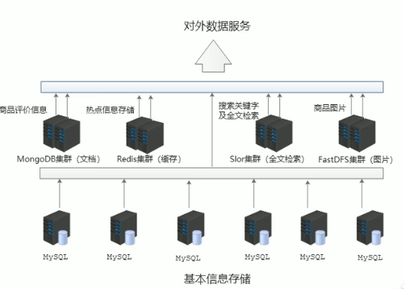
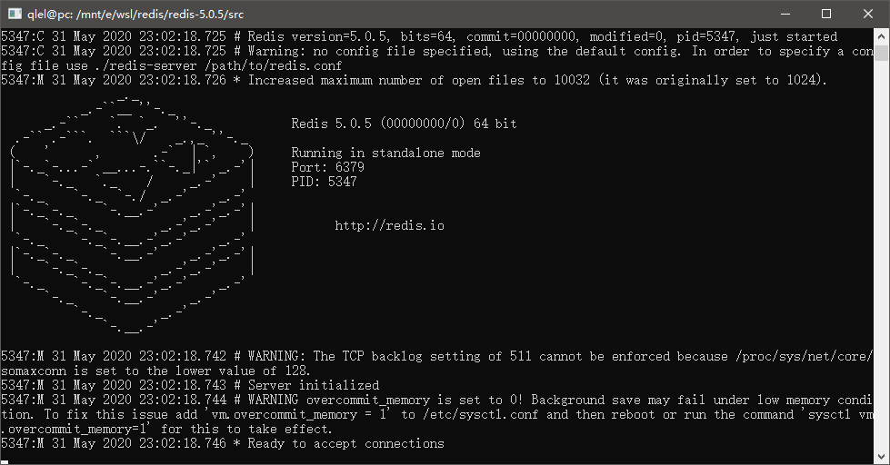
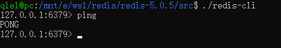
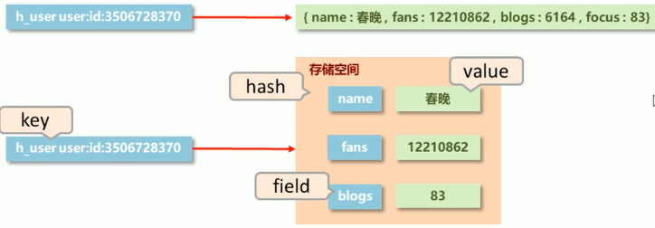
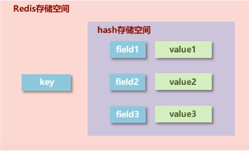
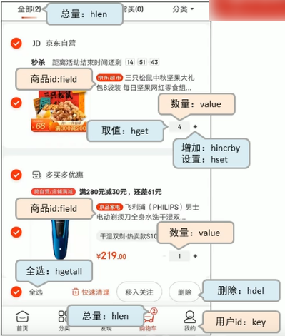
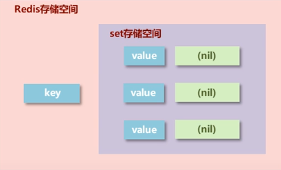
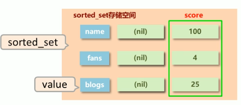

+++
author = "qlel"
title = "redis 学习"
date = "2020-07-16"
description = "redis 2021 年的学习记录"
tags = [
"redis"
]
categories = [
"学习"
]
+++

# 1 redis简介
- 场景
  - 海量用户
  - 高并发
- 关系型数据库存在的问题
  - 性能瓶颈：磁盘IO性能低下
  - 扩展瓶颈：数据关系复杂，扩展性差，不便于大规模集群
- 解决思路：NoSQL
  - 降低磁盘IO次数，越低越好  --> 内存存储
  - 去除数据间关系，越简单越好  --> 不存储关系，仅存储数据

- NoSQL：即Not-Only SQL ，泛指非关系型的数据库，作为关系型数据库的补充。
  - 应对基于海量用户的海量数据前提下的数据处理问题。
  - 特征：
    - 可扩容，可伸缩
    - 大数据量下高性能
    - 灵活的数据类型
    - 高可用
  - 常见的NoSQL数据库
    - Redis
    - memcache
    - HBase
    - MongoDB
- 如：电商场景
  - 商品的基本信息：访问不频繁的放MySQL
    - 名称
    - 价格
    - 厂商
  - 商品的附加信息：访问频繁一些的放MongoDB
    - 描述
    - 详情
    - 评论
  - 图片信息：分布式文件系统
  - 搜索关键字：ES、Lucene、solr等
  - 热点信息：Redis、memcache、tair
    - 高频
    - 波段性



## 概念与应用
Redis(REmote DIctionary Server)是用C语言开发的一个开源的高性能键值对(key-value)数据库。

应用：
- 为热点数据加速查询，如热点商品、热点新闻、热点咨询、推广类等高访问量信息等
- 任务队列，如秒杀、抢购、购票排队等
- 即时信息查询，如排行榜、网站访问统计、公交到站信息、在线人数信息(聊天室、网站)、设备信号等
- 时效性信息控制，如验证码控制、股票控制等
- 分布式数据共享，如分布式集群架构中的session分离
- 消息队列
- 分布式锁

---
# 2 安装
在Windows的子系统wsl-debian下源码安装：
到官网下载源码包解压得`redis-5.0.5`目录
```bash
# 安装gcc和make
sudo apt install gcc
sudo apt install make

# 进入 redis-5.0.5 目录
cd redis-5.0.5

# 直接make编译
make

# 编译完成后进入 redis-5.0.5/src 目录
cd src

# redis-server 文件为服务启动文件
./redis-server

# redis-cli 为内置的客户端
./redis-cli
```
服务启动截图：


内置客户端启动截图：


# 3 基本操作
## 功能性命令
- 信息添加：设置key,value数据
```bash
# 命令
set {key} {value}

# 示例
set name hello
```
- 信息查询：
根据key查询对应的value，如果不存在，返回空(`nil`)
```bash
# 命令
get {key}

# 示例
get name
```

---
## 清除屏幕信息
```bash
clear
```

## 帮助信息查阅
```bash
help 命令名称
help @组名
```

## 退出指令
```bash
quit
exit
```

---
# 4 数据类型
## 字符串(string)
redis自身是一个Map，其中所有的数据都是采用key:value的形式存储。

string类型是二进制安全的。意思是redis的string可以包含任何数据。比如jpg图片或者序列化的对象 。

string类型是Redis最基本的数据类型，一个键最大能存储512MB。

- 存储的数据：
单个数据，最简单的数据存储类型，也是最常用的数据存储类型
- 存储数据的格式：
一个存储空间保存一个数据
- 存储内容：
通常使用字符串，如果字符串以整数的形式展示，可以作为数字操作使用


基本操作
```bash
# 添加/修改数据
set key value

# 添加数据，如果key已存在，则会失败；不能修改数据
setnx key value

# 获取数据
get key

# 删除数据
del key

# 添加/修改多个数据
mset key1 value1 key2 value2 ...

# 获取多个数据
mget key1 key2 ...

# 获取数据字符个数(字符串长度)
strlen key

# 追加信息到原始信息后部(如果原始信息存在就追加，否则新建)
append key value
```

### 业务场景1

大型企业级应用中，分表操作是基本操作，使用多张表存储同类型数据，但是对应的主键id必须保证统一性，不能重复。Oracle数据库具有sequence设定，可以解决该问题，但是MySQL数据库并不具有类似的机制，那么如何解决？

>解决方案

- 设置数值数据增加指定范围的值
```bash
# 将 key 中储存的数字值增一。
incr key

# 将 key 所储存的值加上给定的增量值（increment） 。
incrby key increment

# 将 key 所储存的值加上给定的浮点增量值（increment） 。
incrbyfloat key increment
```
- 设置数值数据减少指定范围的值
```bash
# 将 key 中储存的数字值减一。
decr key

# key 所储存的值减去给定的减量值（decrement） 。
decrby key increment
```
- 示例
```bash
127.0.0.1:6379> set num 3
OK
127.0.0.1:6379> incr num
(integer) 4
127.0.0.1:6379> incr num
(integer) 5
127.0.0.1:6379> decr num
(integer) 4
127.0.0.1:6379> decr num
(integer) 3
127.0.0.1:6379> incrby num 10
(integer) 13
127.0.0.1:6379> decrby num 6
(integer) 7
127.0.0.1:6379> incrbyfloat num 1.5
"8.5"
```
- string作为数值进行操作
  - string在redis内部存储默认就是一个字符串，当遇到增减类操作`incr`、`decr`时会转成数值型进行计算。
  - redis所有的操作都是原子性的，采用单线程处理所有业务，命令也是一个一个执行的，因此无需考虑并发带来的数据影响。
  - 注意：按数值进行操作的数据，如果原始数据不能转成数值，或超越了redis数值上限范围，将报错。
  - redis用于控制数据表主键id，为数据表主键提供生成策略，保障数据库表的主键唯一性
  - 此方案适用于所有数据库，且支持数据库集群

### 业务场景2
时效性：
电商商家开启热门商品推荐，热门商品不能一直处于热门期，每种商品热门期维持3天，3天后取消热门。
还有热点新闻的时效性等。

>解决方案

- 设置数据具有指定的生命周期
```bash
# 将值 value 关联到 key ，并将 key 的过期时间设为 seconds (以秒为单位)。
setex key seconds value

# 将值 value 关联到 key ，并将 key 的过期时间设为 milliseconds (以毫秒为单位)。
psetex key milliseconds value
```
- 示例
```bash
127.0.0.1:6379> setex tel 10 177777
OK
127.0.0.1:6379> get tel
"177777"
127.0.0.1:6379> get tel
(nil)
```
- 注意：设置`setex`设置的key可以被`set`设置的key覆盖，导致时效性失效。

### 业务场景3
比如微博用户的粉丝数、文章数、关注数
- 在redis中为用户设定用户信息，以用户主键和属性值作为key，后台设定定时刷新策略即可
```bash
# key                   value
user:id:321555:fans --> 122100
user:id:321555:blogs --> 105
user:id:321555:focuss --> 99
```

- 在redis中以json格式存储用户信息的，定时刷新(也可以使用hash类型)
```bash
# key               value
user:id:321555 --> {id:321555,name:春晚,fans:122100,blogs:105,focuss:99}
```

```bash
127.0.0.1:6379> set user:id:32155:fans 122100
OK
127.0.0.1:6379> incr user:id:32155:fans
(integer) 122101
127.0.0.1:6379> set user:id:321555 {id:321555,name:春晚,fans:122100,blogs:105,focuss:99}
OK
127.0.0.1:6379> get user:id:321555
"{id:321555,name:\xe6\x98\xa5\xe6\x99\x9a,fans:122100,blogs:105,focuss:99}"
```
- redis应用于各种结构型和非结构型高热度数据访问加速
- key的设置约定
表名:主键名:主键值:字段名

### 注意事项
- 数据操作不超过的反馈与数据正常操作之间的差异
  - 表示运行结果是否成功
    - (integer) 0 --> false 失败
    - (integer) 1 --> true 成功
  - 表示运行结果值
    - (integer) 3 --> 3 数值3
    - (integer) 1 --> 1 数值1
  - 数据未获取到
    - (nil) 等同于null
  - 数据最大存储量
    - 512MB

---
## 哈希(hash)
Redis hash 是一个键值对集合。

Redis hash是一个string类型的field和value的映射表，hash特别适合用于存储对象。

- 新的存储需求：对一系列存储的数据进行编组，方便管理
- 需要的存储结构：一个存储空间保存多个键值对数据


- hash存储结构优化
  - 如果field数量较少，存储结构优化为类数组结构
  - 如果field数量较多，存储结构使用HashMap结构

- 基本操作：
```bash
# 添加/修改数据
hset key field value

# 获取数据
hget key field
hgetall key

# 删除字段数据
hdel key field1 [field2 ...]

# 删除所有字段包括key
del key

# 添加/修改多个数据
hmset key field1 value1 field2 value2 ...

# 获取多个数据
hmget key field1 field2 ...

# 获取哈希表中字段的数量
hlen key

# 判断hash表中是否存在指定的字段
hexists key field

# 获取哈希表中所有字段名和字段值
hkeys key
hvals key

# 设置指定字段的数值数据增加指定范围的值
hincrby key field increment
hincrbyfloat key field increment

# 只有在字段 field 不存在时，设置哈希表字段的值。
hsetnx key field value 
```
- 示例
```bash
127.0.0.1:6379> hmset user name qlel age 18 weight 64
OK
127.0.0.1:6379> hgetall user
1) "name"
2) "qlel"
3) "age"
4) "18"
5) "weight"
6) "64"
127.0.0.1:6379> hlen user
(integer) 3
127.0.0.1:6379> hexists user name
(integer) 1
127.0.0.1:6379> hexists user height
(integer) 0
127.0.0.1:6379> hkeys user
1) "name"
2) "age"
3) "weight"
127.0.0.1:6379> hvals user
1) "qlel"
2) "18"
3) "64"
```
- 注意事项
  - hash类型下的value只能存储字符串，不允许存储其他数据类型，不存在嵌套现象。如果数据未获取到，对应的值为(nil)
  - 每个hash可以存储2^32^-1个键值对
  - hash类型十分贴近对象的数据存储形式，并且可以灵活添加删除对象属性。但是hash设计初衷不是为了存储大量对象，不可滥用，不可将hash作为对象列表使用
  - hgetall操作可以获取全部属性，如果内部field过多，遍历整体数据效率就会很低，有可能成为数据访问瓶颈

### hash的应用场景
>业务场景1

电商网站购物车设计与实现

- 业务分析
  - 仅分析购物车的redis存储模型
  添加、浏览、更改数量、删除清空
  - 购物车于数据库间持久化同步（不讨论）
  - 购物车于订单间关系（不讨论）
    - 提交购物车：读取数据生成订单
    - 商家临时价格调整：隶属于订单级别
  - 未登录用户购物车信息存储（不讨论）
    - cookie存储
- 解决方案
  - 以客户id作为key，每位客户创建一个hash存储结构存储对应的购物车信息
  - 将商品编号作为field，购买数量作为value进行存储
  - 添加商品：追加全新的field与value
  - 浏览：遍历hash
  - 更改数量：自增/自减，设置value值
  - 删除商品：删除field
  - 清空：删除key

```bash
# 创建
127.0.0.1:6379> hmset id:001 g01 2 g02 5 g03 8
OK

# 追加
127.0.0.1:6379> hset id:001 g07 55
(integer) 1

# 浏览
127.0.0.1:6379> hgetall id:001
1) "g01"
2) "2"
3) "g02"
4) "5"
5) "g03"
6) "8"
7) "g07"
8) "55"

# 增加/减少 数量
127.0.0.1:6379> hincrby id:001 g01 3
(integer) 5
127.0.0.1:6379> hincrby id:001 g03 -2
(integer) 6

# 删除商品
127.0.0.1:6379> hdel id:001 g02
(integer) 1
127.0.0.1:6379> hgetall id:001
1) "g01"
2) "5"
3) "g03"
4) "6"
5) "g07"
6) "55"

# 清空
127.0.0.1:6379> del id:001
(integer) 1
127.0.0.1:6379> hgetall id:001
(empty list or set)
```
>❓ 当前设计是否加速了购物车的呈现？

当前仅仅是将数据存储到了redis中，并没有起到加速的作用，商品信息还需要二次查询数据库
- 每条购物车中的商品记录保存成两条field
- filed1专用于保存购买数量
  - 命名格式：商品id:nums
  - 保存数据：数值
- filed2专用于保存购物车中显示的信息，包含文字描述，图片地址，所属商家信息等
  - 命名格式：商品id:info
  - 保存数据：json

```bash
hmset uid01 g01:nums 100 g01:info {...}
```
---
>业务场景2

抢购：
双11活动日，销售手机充值卡的商家对移动、联通、电信的30元、50元、100元商品推出抢购活动，每种商品抢购上线1000张

- 解决方案
  - 以商家id作为key
  - 将参与抢购的商品id作为field
  - 将参与抢购的商品数量作为对应的value
  - 抢购时使用降值的方式控制产品数量
  - 实际问题中还有超卖等实际问题，这里不做讨论

---
## 列表(list)
- 数据存储需求：存储多个数据，并对数据进入存储空间的顺序进行区分
- 需要的存储结构：一个存储空间可以保存多个数据，且通过数据可以体现进入顺序
- list类型：保存多个数据，底层使用**双向链表**存储结构实现

>基本操作

```bash
# 添加/修改数据
lpush key value1 [value2 ....]
rpush key value1 [value2 ....]

# 获取数据
lrange key start stop
lindex key index

# 获取长度
llen key

# 获取并移除数据
lpop key
rpop key

# 规定时间内获取并移除数据
# 如果列表有元素会马上取出并移除元素
# 如果列表没有元素会阻塞列表直到等待超时或发现可弹出元素为止
blpop key1 [key2...] timeout
brpop key1 [key2...] timeout

# 删除指定数据
lrem key count value
```

>示例

```bash
127.0.0.1:6379> lpush list php python java rust go
(integer) 5
127.0.0.1:6379> lrange list 0 3
1) "go"
2) "rust"
3) "java"
4) "python"
127.0.0.1:6379> lrange list 0 -1
1) "go"
2) "rust"
3) "java"
4) "python"
5) "php"
127.0.0.1:6379> lrange list 0 -2
1) "go"
2) "rust"
3) "java"
4) "python"
127.0.0.1:6379> lrange list -1 2
(empty list or set)
127.0.0.1:6379> lindex list 1
"rust"
127.0.0.1:6379> llen list
(integer) 5
127.0.0.1:6379> lpop list
"go"
127.0.0.1:6379> rpop list
"php"
127.0.0.1:6379> lrange list 0 -1
1) "rust"
2) "java"
3) "python"

# 列表只要一个元素python
127.0.0.1:6379> lrange list 0 -1
1) "python"

# 10s内从list取出元素
127.0.0.1:6379> blpop list 10
1) "list"
2) "python"

# 查看全部元素，为空
127.0.0.1:6379> lrange list 0 -1
(empty list or set)

# 再等待10s取出元素，如果有，立即取出；
# 没有则等待10s至超时
127.0.0.1:6379> blpop list 10
(nil)
(10.03s)
127.0.0.1:6379>
```

>业务场景1

微信朋友圈点赞，要求按顺序显示点赞好友信息
如果取消点赞就删除相应的信息
```bash
127.0.0.1:6379> rpush list1 a b c d a b c a b s
(integer) 10
127.0.0.1:6379> lrange list1 0 -1
 1) "a"
 2) "b"
 3) "c"
 4) "d"
 5) "a"
 6) "b"
 7) "c"
 8) "a"
 9) "b"
10) "s"

# 删除2个a
127.0.0.1:6379> lrem list1 2 a
(integer) 2
127.0.0.1:6379> lrange list1 0 -1
1) "b"
2) "c"
3) "d"
4) "b"
5) "c"
6) "a"
7) "b"
8) "s"
```
>业务场景2

list实现日志消息队列

twitter、新浪微博、腾讯微博中个人用户的关注列表需要按照用户的关注顺序进行展示，粉丝列表需要将最近关注的粉丝列在前面
新闻、资讯类网站如何将最新的新闻或资讯按照发生的时间顺序展示?

企业运营过程中，系统将产生出大量的运营数据，如何保障多台服务器操作日志的统一顺序输出?

- 解决方案
  - 依赖list的数据具有顺序的特征对信息进行管理
  - 使用队列模型解决多路信息汇总合并的问题
  - 使用栈模型解决最新消息的问题

### list注意事项
- list中保存的数据都是string类型的，数据总容量是有限的，最多2^32^-1个元素
- list具有索引的概念，但是操作数据时通常以队列的形式进行入队出队操作，或以栈的形式进行入栈出栈操作
- 获取全部数据操作结束索引设置为-1
- list可以对数据进行分页操作，通常第一页的信息来自于list，第二页及更多的信息通过数据库的形式加载

---
## 集合(set)
- 新的存储需求:存储大量的数据，在查询方面提供更高的效率
- 需要的存储结构:能够保存大量的数据，高效的内部存储机制，便于查询
- set类型:与hash存储结构完全相同，仅存储键，不存储值(nil) ,并且值是**不允许重复**的



>基本操作

```bash
# 添加数据
sadd key member1 [member2 ...]

# 获取全部数据
smembers key

# 删除数据
srem key member1 [member2 ...]

# 获取集合数据总量
scard key

# 判断集合中是否包含指定数据
sismember key member

# 随机获取集合中指定数量的数据
srandmember key [count]

# 随机获取集合中的某个数据并将该数据移出集合
spop key [count]
```
>示例

```bash
127.0.0.1:6379> sadd users aa bb cc dd ee ff
(integer) 6
127.0.0.1:6379> smembers users
1) "aa"
2) "bb"
3) "dd"
4) "cc"
5) "ee"
6) "ff"
127.0.0.1:6379> srem users dd ee
(integer) 2
127.0.0.1:6379> smembers users
1) "cc"
2) "aa"
3) "bb"
4) "ff"
127.0.0.1:6379> scard users
(integer) 4
127.0.0.1:6379> sismember users aa
(integer) 1
127.0.0.1:6379> sismember users abc
(integer) 0

# 随机获取2个数据
127.0.0.1:6379> srandmember users 2
1) "aa"
2) "ff"
127.0.0.1:6379> srandmember users 2
1) "ff"
2) "bb"

# 随机删除数据
127.0.0.1:6379> spop users
"aa"
127.0.0.1:6379> smembers users
1) "cc"
2) "bb"
3) "ff"
```

>业务场景1

每位用户首次使用今日头条时会设置3项爱好的内容,但是后期为了增加用户的活跃度、兴趣点，必须让用户对其他信息类别逐渐产生兴趣，增加用户留存度,如何实现?

- 业务分析
  - 系统分析出各个分类的最新或最热点信息条目并组织成set集合
  - 随机挑选其中部分信息
  - 配合用户关注信息分类中的热点信息组织成展示的全信息集合

- 解决方案
  - 随机从集合中取出热点信息

### set数据交并差操作
>业务场景1

脉脉为了促进用户间的交流,保障业务成单率的提升，需要让每位用户拥有大量的好友,事实上职场新人不具有更多的职场好友，如何快速为用户积累更多的好友?
新浪微博为了增加用户热度,提高用户留存性，需要微博用户在关注更多的人，以此获得更多的信息或热门话题，如何提高用户关注他人的总量?

- 解决方案

```bash
# 求两个集合的交、并、差集
sinter key1 [key2 ...]
sunion key1 [key2 ...]
sdiff key1 [key2 ...]

# 求两个集合的交、并、差集并存储到指定集合中
sinterstore key1 [key2 ...]
sunionstore key1 [key2 ...]
sdiffstore key1 [key2 ...]

# 将指定数据从原始集合中移动到目标集合中
smove source destination member
```


>示例

```bash
127.0.0.1:6379> sadd u1 aa bb cc
(integer) 3
127.0.0.1:6379> sadd u2 bb cc dd ee
(integer) 4

# 求交集
127.0.0.1:6379> sinter u1 u2
1) "cc"
2) "bb"

# 求并集
127.0.0.1:6379> sunion u1 u2
1) "ee"
2) "aa"
3) "bb"
4) "cc"
5) "dd"

# 求差，有方向性
127.0.0.1:6379> sdiff u1 u2
1) "aa"
127.0.0.1:6379> sdiff u2 u1
1) "ee"
2) "dd"

# 将u2中的ee移动到u1中
127.0.0.1:6379> smove u2 u1 ee
(integer) 1
127.0.0.1:6379> smembers u1
1) "cc"
2) "ee"
3) "aa"
4) "bb"
```
>Tips:
- redis应用于同类信息的关联搜索，二度关联搜索，深度关联搜索
- 显示共同关注(一度)
- 显示共同好友(一度)
- 由用户A出发，获取到好友用户B的好友信息列表(一度)
- 由用户A出发，获取到好友用户B的购物清单列表(二度)
- 由用户A出发，获取到好友用户B的游戏充值列表(二度)

### 注意事项
- set类型不允许数据重复，如果添加的数据在set中已经存在，将只保留一份
- set虽然与hash的存储结构相同，但是无法启用hash中存储值的空间

### 其他业务场景
>业务场景1

集团公司共具有12000名员工，内部OA系统中具有700多个角色，3000多个业务操作，23000多种数据，每位员工具有一个或多个角色，如何快速进行业务操作的权限校验?

- 解决方案
  - 依赖set集合数据不重复的特征，依赖set集合hash存储结构特征完成数据过滤与快速查询
  - 根据用户id获取用户所有角色
  - 根据用户所有角色获取用户所有操作权限放入set集合
  - 根据用户所有角色获取用户所有数据权限放入set集合

```bash
127.0.0.1:6379> sadd rid:001 getAll getById
(integer) 2
127.0.0.1:6379> sadd rid:002 getCount getAll
(integer) 2
127.0.0.1:6379> sunionstore rid:007 rid:001 rid:002
(integer) 3
127.0.0.1:6379> smembers rid:007
1) "getCount"
2) "getById"
3) "getAll"
```
>业务场景2

公司对旗下新的网站做推广,统计网站的PV (访问量) ,UV (独立访客) ,IP (独立IP) 。
PV:网站被访问次数，可通过刷新页面提高访问量
UV:网站被不同用户访问的次数，可通过cookie统计访问量，相同用户切换IP地址, UV不变
IP:网站被不同IP地址访问的总次数，可通过IP地址统计访问量，相同IP不同用户访问，IP不变

- 解决方案
  - 利用set集合的数据**去重**特征，记录各种访问数据
  - 建立string类型数据,利用incr统计日访问量(PV)
  - 建立set模型，记录不同cookie数量(UV)
  - 建立set模型，记录不同IP数量(IP)

```bash
127.0.0.1:6379> sadd ips 1.2.3.4
(integer) 1
127.0.0.1:6379> sadd ips 2.3.4.5
(integer) 1
127.0.0.1:6379> sadd ips 2.3.4.5
(integer) 0
127.0.0.1:6379> scard ips
(integer) 2
```
>业务场景3

**黑名单**
资讯类信息类网站追求高访问量，但是由于其信息的价值，往往容易被不法分子利用,通过爬虫技术,快速获取信息，个别特种行业网站信息通过爬虫获取分析后,可以转换成商业机密进行出售。例如第三方火车票、机票、酒店刷票代购软件,电商刷评论、刷好评。

同时爬虫带来的伪流量也会给经营者带来错觉，产生错误的决策，有效避免网站被爬虫反复爬取成为每个网站都要考虑的基本问题。在基于技术层面区分出爬虫用户后,需要将此类用户进行有效的屏蔽,这就是**黑名单**的典型应用。

ps:不是说爬虫一定做摧毁性的工作, 有些小型网站需要爬虫为其带来一些流量。

**白名单**
对于安全性更高的应用访问，仅仅靠黑名单是不能解决安全问题的，此时需要设定可访问的用户群体,依赖**白名单**做更为苛刻的访问验证。

- 解决方案
  - 基于经营战略设定问题用户发现、鉴别规则
  - 周期性更新满足规则的用户黑名单，加入set集合
  - 用户行为信息达到后与黑名单进行比对，确认行为去向
  - 黑名单过滤IP地址:应用于开放游客访问权限的信息源
  - 黑名单过滤设备信息:应用于限定访问设备的信息源
  - 黑名单过滤用户:应用于基于访问权限的信息源

---
## 有序集合(sorted_set)
- 新的存储需求:数据排序有利于数据的有效展示，需要提供一种可以根据自身特征进行排序的方式
- 需要的存储结构:新的存储模型，可以保存可排序的数据
- sorted_set类型:在set的存储结构基础上添加可排序字段score



>基本操作

```bash
# 添加数据
zadd key score1 member1 [score2 member2 ...]

# 获取全部数据
zrange key start stop [withscores]
zrevrange key start stop [withscores]

# 删除数据
zrem key member1 [member2 ...]

```
>示例

```bash
127.0.0.1:6379> zadd price 8 apple
(integer) 1
127.0.0.1:6379> zadd price 2 banana
(integer) 1
127.0.0.1:6379> zadd price 4 orange
(integer) 1
127.0.0.1:6379> zrange price 0 -1
1) "banana"
2) "orange"
3) "apple"
127.0.0.1:6379> zrange price 0 -1 withscores
1) "banana"
2) "2"
3) "orange"
4) "4"
5) "apple"
6) "8"
127.0.0.1:6379> zrevrange price 0 -1 withscores
1) "apple"
2) "8"
3) "orange"
4) "4"
5) "banana"
6) "2"
127.0.0.1:6379> zrem price banana
(integer) 1
127.0.0.1:6379> zrange price 0 -1
1) "orange"
2) "apple"
```
### 按条件获取/删除数据
```bash
# 按条件获取数据
zrangebyscore key min max [withscores] [limit]
zrevrangebyscore key max min [withscores]

# 按条件删除数据 ： 索引rank、排序值score
zremrangebyrank key start stop
zremrangebyscore key min max
```
- 注意
  - min与max用于限定搜索查询的条件
  - start与stop用于限定查询范围，作用于索引，表示开始和结束索引
  - offset与count用于限定查询范围，作用于查询结果，表示开始位置和数据总量

>示例
```bash
127.0.0.1:6379> zrange price 0 -1 withscores
 1) "banana"
 2) "2"
 3) "orange"
 4) "4"
 5) "peach"
 6) "6"
 7) "apple"
 8) "8"
 9) "papaya"
10) "10"
11) "grape"
12) "12"

# 按score排序值查询
127.0.0.1:6379> zrangebyscore price 4 10
1) "orange"
2) "peach"
3) "apple"
4) "papaya"
127.0.0.1:6379> zrangebyscore price 4 10 limit 0 3 withscores
1) "orange"
2) "4"
3) "peach"
4) "6"
5) "apple"
6) "8"
```
### 数据总数和交、并操作
```bash
# 获取集合数据总量
zcard key
zcount key min max

# 集合交、并操作 numkeys表示key的数量
zinterstore destination numkeys key [key ...]
zunionstore destination numkeys key [key ...]
```
>示例

```bash
127.0.0.1:6379> zrange price 0 -1 withscores
 1) "banana"
 2) "2"
 3) "orange"
 4) "4"
 5) "peach"
 6) "6"
 7) "apple"
 8) "8"
 9) "papaya"
10) "10"
11) "grape"
12) "12"
127.0.0.1:6379> zcard price
(integer) 6
127.0.0.1:6379> zcount price 4 10
(integer) 4
```
```bash
127.0.0.1:6379> zadd s1 1 aa 2 bb 3 cc
(integer) 3
127.0.0.1:6379> zadd s2 4 aa 5 bb 6 dd
(integer) 3
127.0.0.1:6379> zadd s3 7 aa 8 bb 9 ee
(integer) 3
127.0.0.1:6379> zinterstore s4 3 s1 s2 s3
(integer) 2

# 交集的排序值都求和了
127.0.0.1:6379> zrange s4 0 -1 withscores
1) "aa"
2) "12"
3) "bb"
4) "15"

127.0.0.1:6379> help zinterstore

  ZINTERSTORE destination numkeys key [key ...] [WEIGHTS weight] [AGGREGATE SUM|MIN|MAX]
  summary: Intersect multiple sorted sets and store the resulting sorted set in a new key
  since: 2.0.0
  group: sorted_set

# 还能求最大值和最小值
127.0.0.1:6379> zinterstore s5 3 s1 s2 s3 aggregate min
(integer) 2
127.0.0.1:6379> zrange s5 0 -1 withscores
1) "aa"
2) "1"
3) "bb"
4) "2"
```
### score的获取和修改
```bash
# 获取数据排序后对应的索引
zrank key member
zrevrank key member

# score值的获取 和修改
zscore key member
zincrby key incrememt member
```
>示例

```bash
127.0.0.1:6379> zadd s1 5 aa 3 bb 9 cc
(integer) 3
127.0.0.1:6379> zrank s1 aa
(integer) 1
127.0.0.1:6379> zrank s1 bb
(integer) 0

# 获取排序值
127.0.0.1:6379> zscore s1 cc
"9"

# 修改score
127.0.0.1:6379> zincrby s1 5 aa
"10"
127.0.0.1:6379> zrange s1 0 -1 withscores
1) "bb"
2) "3"
3) "cc"
4) "9"
5) "aa"
6) "10"
```
### 注意事项
- score保存的数据存储空间是64位,如果是整数范围是9007199254740992~9007199254740992
- score保存的数据也可以是一个双精度的double值,基于双精度浮点数的特征，可能会丢失精度,使用时候要慎重
- sorted_ set底层存储还是基于set结构的，因此数据不能重复，如果重复添加相同的数据，score值将被反复覆盖，保留最后一次修改的结果

---
# key通用指令
- key特征
  - key是一个字符串，通过key获取redis中保存的数据
- key应该设计哪些操作
  - 对于key自身状态的相关操作，例如:删除，判定存在，获取类型等
  - 对于key有效性控制相关操作，例如:有效期设定，判定是否有效,有效状态的切换等
  - 对于key快速查询操作，例如:按指定策略查询key

## key基本操作
```bash
# 删除指定key
del key

# 获取key是否存在
exists key

# 获取key类型
type key
```
## key时效性控制
```bash
# 为指定key设置有效期
expire key seconds
pexpire key milliseconds
expireat key timestamp
pexpireat key milliseconds-timestamp

# 获取key的有效时间
ttl key
pttl key

# 切换key从时效性转换为永久
persist key
```
>示例

```bash
127.0.0.1:6379> expire aa1 10
(integer) 1
127.0.0.1:6379> ttl aa1
(integer) 5
127.0.0.1:6379> ttl aa1
(integer) 3
127.0.0.1:6379> ttl aa1
(integer) 1
127.0.0.1:6379> ttl aa1
(integer) -2
127.0.0.1:6379> ttl aa1
(integer) -2
```
## 查询key
```bash
keys pattern
```
- pattern通配符
  - `*`：匹配任意数量字符
  - `?`：匹配一个任意字符
  - `[]`：字符集合。匹配所包含的任意一个字符。
>示例
```bash
127.0.0.1:6379> keys *
1) "s1"
2) "c"
3) "b"
4) "price"
5) "user:id:32155:fans"
6) "num"
7) "user:id:321555"
8) "a"
127.0.0.1:6379> keys pr*
1) "price"
127.0.0.1:6379> keys ??er*
1) "user:id:32155:fans"
2) "user:id:321555"
127.0.0.1:6379> keys p[abcr]ice
1) "price"
127.0.0.1:6379> keys *[i]*
1) "price"
2) "user:id:32155:fans"
3) "user:id:321555"
```
## key的其他操作
```bash
# 重命名key，如果存在同名key，则覆盖已存在的key
rename key newkey

# 重命名key，如果存在同名key，则失败
renamenx key newkey

# 对所有key的数据进行排序，不改变原数据
sort

# 其他key通用操作
help @generic
```
>示例
```bash
127.0.0.1:6379> keys *
1) "s1"
2) "c"
3) "b"
4) "price"
5) "user:id:32155:fans"
6) "num"
7) "user:id:321555"
8) "a"
127.0.0.1:6379> rename user:id:321555 a1
OK
127.0.0.1:6379> keys *
1) "s1"
2) "c"
3) "b"
4) "price"
5) "user:id:32155:fans"
6) "a1"
7) "num"
8) "a"

# 排序
127.0.0.1:6379> lpush aa 5 3 8 6 1
(integer) 5
127.0.0.1:6379> sort aa
1) "1"
2) "3"
3) "5"
4) "6"
5) "8"
127.0.0.1:6379> lrange aa 0 -1
1) "1"
2) "6"
3) "8"
4) "3"
5) "5"
```
---
# 数据库通用指令
- key的重复问题
  - key是由程序员定义的
  - redis在使用过程中，伴随着操作数据量的增加，会出现大量的数据以及对应的key
  - 数据不区分种类、类别混杂在一起，极易出现重复或冲突
- 解决方案
  - redis为每个服务提供有16个数据库,编号从0到15,默认0
  - 每个数据库之间的数据相互独立

## db基本操作
```shell
# 切换数据库
select index

# 离开
quit

# 检测是否连通，连通则默认返回pong
ping

# 打印信息
echo message

# 数据移动，必须是操作db有，目标db没有的key
move key db

# 查看当前db有多少key
dbsize

# 清除当前db数据
flushdb

# 清除所有db数据
flushall
```
>示例

```shell
127.0.0.1:6379> select 1
OK
127.0.0.1:6379[1]> select 9
OK
127.0.0.1:6379[9]> select 0
OK
127.0.0.1:6379> echo hello
"hello"
127.0.0.1:6379> ping
PONG
127.0.0.1:6379> ping aaaa
"aaaa"

# 数据移动
127.0.0.1:6379> set a1 hello
OK
127.0.0.1:6379> move a1 3
(integer) 1
127.0.0.1:6379> select 3
OK
127.0.0.1:6379[3]> get a1
"hello"

# 数据清除
127.0.0.1:6379> dbsize
(integer) 8
127.0.0.1:6379> flushall
OK
127.0.0.1:6379> dbsize
(integer) 0
```
---
# 计数器
- 应用场景
  - **频率控制：**
  接口防刷，密码尝试次数限制
  - **数量统计：**
  请求量统计
  - **数量控制：**
  商品抢购，奖励额度控制
