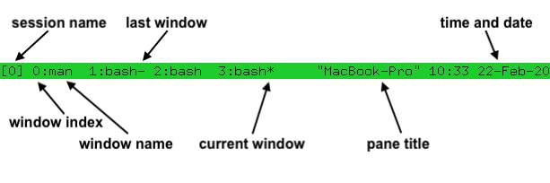

+++
author = "qlel"
title = "tmux_2023"
date = "2023-09-13"
description = "tmux是一个终端多路复用器，能够在单屏条件下创建，访问和控制多个终端窗口。同时在终端窗口断开之后可以在主机后台继续运行，也可以之后重连。"
tags = [
"linux", "tmux"
]
categories = [
"学习"
]
+++

参考：
- http://louiszhai.github.io/2017/09/30/tmux/
- https://www.ruanyifeng.com/blog/2019/10/tmux.html
- https://github.com/tmux/tmux/wiki

tmux是一个终端多路复用器，能够在单屏条件下创建，访问和控制多个终端窗口。同时在终端窗口断开之后可以在主机后台继续运行，也可以之后重连。

tmux将其所有状态保存在一个称为tmux服务器的主进程中。它在后台运行，管理tmux中运行的所有程序，并跟踪它们的输出。当用户运行tmux命令时，tmux服务器会自动启动，默认情况下，当没有运行的程序时，会退出。

tmux采用C/S模型构建，输入tmux命令就相当于启动了一个服务器，此时默认将新建一个会话(session)，然后会话中默认新建一个窗口(window)，窗口中默认新建一个面板(pane)。

结构来讲，就是一个 tmux 可以包含多个 session，一个 session 可以包含多个 window， 一个 window 可以包含多个 pane。

# 前缀键
Tmux 窗口有大量的快捷键。所有快捷键都要通过前缀键唤起。默认的前缀键是`Ctrl+b`，即先按下`Ctrl+b`，快捷键才会生效。

举例来说，帮助命令的快捷键是`Ctrl+b ?`。它的用法是，在 Tmux 窗口中，先按下`Ctrl+b`，再按下`?`，就会显示帮助信息。

然后，按下 `ESC` 键或`q`键，就可以退出帮助。

# 启动与退出
执行`tmux`会创建一个默认会话`0`的session，默认索引为`1`的窗口window，默认一个面板pane。

如果没有程序在前台运行，按`ctrl+d`会从pane开始退出。也可以键入`exit`退出一个对象。

还可以按前缀键`ctrl+b`，松开手指，再按相应的热键`x`退出对象，此时会有个确认事件。

# 会话session
## 新建会话
```bash
# 默认创建一个会话名为0的会话
tmux

# 创建一个指定名称的会话
tmux new -s <session-name>

# 例如
tmux
tmux new -s 'hello'

# 列出
tmux ls
0: 1 windows (created Wed Sep 13 15:05:54 2023)
hello: 1 windows (created Wed Sep 13 15:09:15 2023)
```


## 列出会话
```bash
$ tmux ls
# or
$ tmux list-session
```

## 分离会话
在 Tmux 窗口中，按下`Ctrl+b d`或者输入`tmux detach`命令，就会将当前会话与窗口分离。
```bash
$ tmux detach
```
上面命令执行后，就会退出当前 Tmux 会话，但是会话和里面的进程仍然在后台运行。

## 接入会话
断开会话后，想要接着上次留下的现场继续工作，`tmux attach`命令用于重新接入某个已存在的会话。
```bash
# 默认接入第一个会话
$ tmux attach
# 简写
$ tmux a

# 使用会话编号
$ tmux attach -t 0
# 简写
$ tmux a -t 0

# 使用会话名称
$ tmux attach -t <session-name>
# 简写
$ tmux a -t <session-name>
```

## 杀死会话
```bash
# 关闭服务，所有的会话都将关闭
$ tmux kill-server

# 关闭0会话
$ tmux kill-session -t 0

# 关闭<session-name>会话
$ tmux kill-session -t <session-name>
```

## 切换会话
快捷键： `Ctrl+b s`，然后选中会话，按`->`可以按树展开会话，`<-`闭合会话，上下方向键可选择会话。

```bash
# 使用会话编号
$ tmux switch -t 0

# 使用会话名称
$ tmux switch -t <session-name>
```

## 重命名会话
快捷键： `Ctrl+b $`
```bash
$ tmux rename-session -t <old-name> <new-name>
```

# 窗口window

## 新建窗口
快捷键： `Ctrl+b c`
```bash
$ tmux new-window

# 新建一个指定名称的窗口
$ tmux new-window -n <window-name>
```

## 切换窗口
快捷键：   
- `Ctrl+b w`，然后选中窗口，按`->`可以按树展开窗口，`<-`闭合窗口，上下方向键可选择窗口。
- `Ctrl+b {0-9}`，切换到指定索引的窗口
- `Ctrl+b p`，切换到上一个窗口
- `Ctrl+b n`，切换到下一个窗口
```bash
# 切换到指定编号的窗口
$ tmux select-window -t <window-number>

# 切换到指定名称的窗口
$ tmux select-window -t <window-name>
```

## 重命名窗口
快捷键： `Ctrl+b ,`
快捷键： `Ctrl+b .`，重命名索引，用于排序，不能与其他窗口重复。
```bash
# 重命名当前窗口
$ tmux rename-window <new-name>
```

## 关闭窗口
快捷键： `Ctrl+b &`
```bash
$ tmux kill-window -t <window-name>
```

# 面板pane

## 划分面板
快捷键：
- `Ctrl+b %`，将当前pane左右分半
- `Ctrl+b "`，将当前pane上下分半

```bash
# 划分上下两个面板
$ tmux split-window

# 划分左右两个面板
$ tmux split-window -h
```

## 选择面板
快捷键：
- `Ctrl+b ↑`
- `Ctrl+b ↓`
- `Ctrl+b ←`
- `Ctrl+b →`
- `Ctrl+b ;`
- `Ctrl+b o`

```bash
# 上
$ tmux select-pane -U

# 下
$ tmux select-pane -D

# 左
$ tmux select-pane -L

# 右
$ tmux select-pane -R
```

## 交换面板位置

快捷键：
- `Ctrl+b {`，与上一个面板交换位置(按顺序创建的上一个)
- `Ctrl+b }`，与下一个面板交换位置(按顺序创建的上一个)

```bash
# 与上一个面板交换位置(按顺序创建的上一个)
$ tmux swap-pane -U

# 与下一个面板交换位置(按顺序创建的下一个)
$ tmux swap-pane -D

```

# 快捷指令

以下快捷键的使用默认已按前缀键`Ctrl+b`。

## 系统指令

| 指令     | 描述                                   |
| -------- | -------------------------------------- |
| `?`      | 显示快捷键帮助文档；按q返回            |
| `d`      | 分离当前会话                           |
| `D`      | 选择要分离的会话                       |
| `Ctrl+z` | 挂起当前会话                           |
| `r`      | 选择要分离的会话                       |
| `s`      | 选择并切换会话                         |
| `:`      | 进入命令行模式，此时可直接输入ls等命令 |
| `[`      | 进入复制模式；按q/Esc退出              |
| `]`      | 粘贴复制模式中复制的文本               |
| `~`      | 列出提示信息缓存                       |

## 窗口window指令

| 指令  | 描述                                       |
| ----- | ------------------------------------------ |
| `c`   | 新建窗口                                   |
| `&`   | 关闭当前窗口（关闭前需输入y or n确认）     |
| `0~9` | 切换到指定窗口                             |
| `p`   | 切换到上一窗口                             |
| `n`   | 切换到下一窗口                             |
| `w`   | 打开窗口列表，用于切换窗口                 |
| `,`   | 重命名当前窗口                             |
| `.`   | 修改当前窗口索引编号（适用于窗口重新排序） |
| `f`   | 快速定位到窗口（输入关键字匹配窗口名称）   |

## 面板pane指令

| 指令          | 描述                                                       |
| ------------- | ---------------------------------------------------------- |
| `"`           | 当前面板上下一分为二，下侧新建面板                         |
| `%`           | 当前面板左右一分为二，右侧新建面板                         |
| `x`           | 关闭当前面板（关闭前需输入y or n确认）                     |
| `z`           | 最大化当前面板，再重复一次按键后恢复正常                   |
| `!`           | 当前窗格拆分为一个独立窗口。                               |
| `;`           | 切换到最后一次使用的面板                                   |
| `q`           | 显示面板编号，在编号消失前输入对应的数字可切换到相应的面板 |
| `{`           | 与上一个面板交换位置(按顺序创建的上一个)                   |
| `}`           | 与下一个面板交换位置(按顺序创建的下一个)                   |
| `Ctrl+o`      | 顺时针旋转当前窗口中的所有面板                             |
| `o`           | 选择下一面板                                               |
| `空格键`      | 在自带的面板布局中循环切换                                 |
| `Alt+方向键`  | 以5个单元格为单位调整当前面板边缘                          |
| `Ctrl+方向键` | 以1个单元格为单位调整当前面板边缘                          |
| `t`           | 显示时钟                                                   |